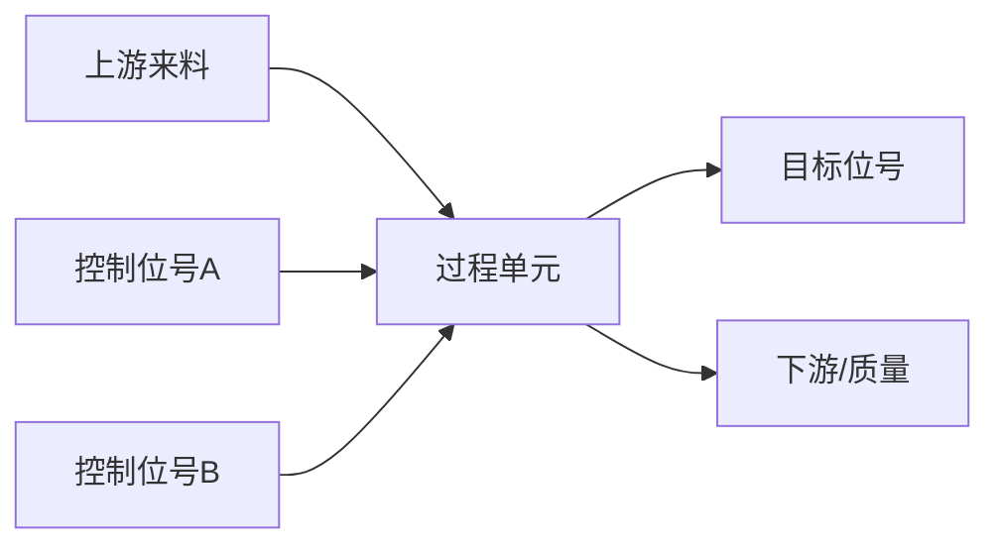

# Control Target EDA

Use this skill to turn raw industrial process data plus basic user context into a process-control analysis pack: inferred process scenario, confirmed target tag, candidate control tags, feasible analysis ranges, Mermaid process-flow Markdown, target tag distribution, target/control time trends, and full-data correlation analysis.

All final generated files must be Chinese:

- HTML file names must use Chinese names.
- Page titles, section titles, table headers, button labels, chart titles, and explanatory notes must be Chinese.
- Do not generate English report filenames such as `target_control_distribution.html`.
- Keep code identifiers and CLI option names in English only where required by the command interface.

## Required Inputs

- Data files or a data directory. Prefer FDE/IIDF-style Parquet; CSV and Excel are supported.
- Basic process context from the user when available: plant, unit, section, material, known tag meanings, control objective, sampling period, operating modes, and process constraints.
- A target tag. Infer candidates from data and context if helpful, but do not silently choose it; ask the user to confirm one target tag before running target/control EDA.
- Control tags. If not supplied, inspect columns, metadata, process context, and statistics first; propose candidates with evidence and ask the user to confirm.
- A time column. Default candidates are `timestamp`, `ts`, `time`, and `datetime`.

IIDF minimum contract used by this skill:

- Internal data is Parquet when available.
- CSV/Excel can be read and treated with the same semantics.
- Time is held in one timestamp column, typically `timestamp`.
- Tag columns are data columns; optional metadata can provide descriptions, units, limits, and tag roles.

## Workflow

1. Locate files and inspect schema before plotting:
   - Identify data files, file format, row counts, columns, time column candidates, numeric tag columns, metadata files, missingness, constant columns, and basic min/max/quantiles.
   - Use metadata descriptions, units, limits, and tag roles when present.
2. Infer the process scenario from data and user context:
   - Classify likely tag roles such as PV, SP, MV, CV, valve position, flow, temperature, pressure, level, analyzer, quality, state, alarm, and mode.
   - Describe the likely process unit, material path, manipulated variables, controlled variables, and downstream quality or performance objective.
   - Mark each inference as evidence-backed or uncertain; do not present inferred process meaning as verified fact.
3. Ask the user to confirm the target tag if it was not explicitly confirmed.
4. After target confirmation, propose control tags:
   - Prefer manipulable or upstream variables: setpoints, valve openings, feed flows, utility flows, pressure/temperature/level controls, and same-unit upstream process variables.
   - Exclude target aliases, downstream outcomes, quality leakage variables, severe-missingness columns, near-constant columns, and variables that are implausible to manipulate.
   - Include a short reason, evidence source, caveat, and expected relation to the target for each candidate.
5. Analyze feasible ranges for the confirmed target and proposed control tags:
   - Report `observed_range` from historical min/max.
   - Report `robust_range` from resistant quantiles such as P1-P99 or P5-P95, depending on outlier severity and data volume.
   - Report `eda_range` for the initial analysis window.
   - State clearly that these are historical analysis ranges, not validated production safety or operating limits.
6. Create `工艺上下文.md` in the output directory before plotting. Include:
   - User inputs and missing context.
   - Data inventory and schema summary.
   - Inferred process scenario with evidence and uncertainties.
   - Confirmed target tag.
   - Candidate control tags table.
   - Feasible range analysis.
   - Mermaid process-flow diagram.
   - Open questions and assumptions.
7. Confirm the control tags if the user did not provide them explicitly.
8. Run the bundled script:

```bash
python scripts/generate_target_control_eda.py \
  --data-dir /path/to/data \
  --target TARGET_TAG \
  --controls TAG_A,TAG_B,TAG_C \
  --time-col timestamp \
  --output-dir /path/to/plotly_eda_outputs
```

9. Open `报告入口.html` and guide the user through the three primary reports:
   - `目标控制统计分布.html`
   - `目标控制时间变化.html`
   - `目标控制相关性分析.html`

Chinese is mandatory for generated reports. `--locale` is retained only for backward compatibility and must not be used to produce English final files.

## 工艺上下文 Markdown

Write `工艺上下文.md` as a compact engineering note, not a long report. Use this structure:

````markdown
# 工艺上下文

## 用户输入

## 数据清单

## 工艺场景推断

## 目标位号

## 候选控制位号

| 位号 | 推断角色 | 证据 | 数据质量 | 建议分析范围 | 注意事项 |
| --- | --- | --- | --- | --- | --- |

## 可行分析范围

## 工艺流程



## 假设与问题
````

Keep Mermaid diagrams editable and simple. Use process equipment or unit names when supported by user context or metadata; otherwise use neutral labels such as upstream, process unit, target, downstream, and control tag. Quote Mermaid node labels that contain punctuation, units, or Chinese text.

## Control Tag Selection Rules

- Treat correlation as screening evidence only. Prefer process plausibility, controllability, and upstream timing over absolute correlation.
- Consider lag, residence time, operating mode, recipe or batch phase, and state segmentation before interpreting relationships.
- Separate manipulated variables from observed disturbance variables. A disturbance can be useful for analysis but is not a control tag unless the operator can act on it.
- Prefer a small, defensible control set over a large correlated list.
- Ask the user to confirm control tags when production meaning or controllability is unclear.

## Script Options

- `--data-dir`: directory containing data files.
- `--files`: explicit file list; comma-separated or repeated.
- `--target`: required target tag.
- `--controls`: comma-separated control tags.
- `--time-col`: timestamp column name; auto-detected when omitted.
- `--metadata`: optional JSON metadata file for tag descriptions and units.
  - Supports `tags`, `columns`, top-level `{tag: metadata}`, and dataset-style `descriptions: {tag: "中文释义"}` mappings.
  - When metadata includes descriptions, generated charts, hover labels, tables, and schema notes should show `位号 + 中文释义`, while preserving the original tag code for engineering traceability.
- `--output-dir`: output directory for standalone HTML reports.
- `--format`: `auto`, `iidf`, `two-row-csv`, `csv`, `excel`, or `parquet`.
- `--max-points-display`: display sampling cap; statistics and correlations remain full-data.
- `--sampling-pairs`: optional JSON config for raw-vs-aggregated sampling impact analysis.
- `--locale`: compatibility option; generated final files remain Chinese.

## Visualization Rules

- Do not use Plotly WebGL traces. Use `go.Scatter`, not `go.Scattergl`.
- Keep statistics and correlations on full available data unless the user explicitly asks otherwise.
- Sampling is only for rendering large time-series and scatter plots.
- Distribution pages should combine horizontal distribution overview with key metrics and full summary tables.
- Correlation is a screening view, not causal evidence. Mention lag, state segmentation, and process constraints when interpreting results.
- Time-series pages should provide Chinese buttons for switching between points-only and points-with-lines display.
- Ensure generated charts have coordinated layout with no obvious overlap among titles, subplot titles, legends, axis labels, tick labels, and mode buttons.
- Truncate long tag descriptions in in-plot labels and keep the full text in hover text or summary tables.
- For correlation heatmaps, do not put full long tag names in hover labels. Use concise hover text and keep complete tag details in the detail table.
- Allocate explicit margins, bottom legend space, and minimum chart width for dense multi-panel Plotly figures.

## Dependencies

The script requires Python packages: `pandas`, `numpy`, and `plotly`. For all supported formats, add `pyarrow` and `openpyxl`.

Prefer project-local dependencies:

```bash
python -m pip install --target .python_deps pandas numpy plotly pyarrow openpyxl
```

The script automatically adds `.python_deps` from the current working directory and the skill directory to `sys.path`.
